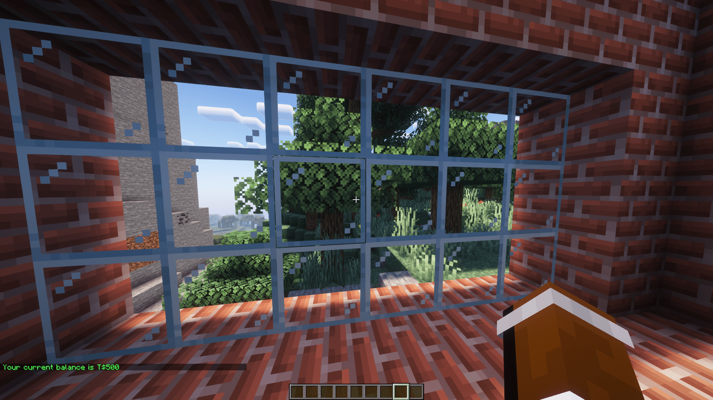
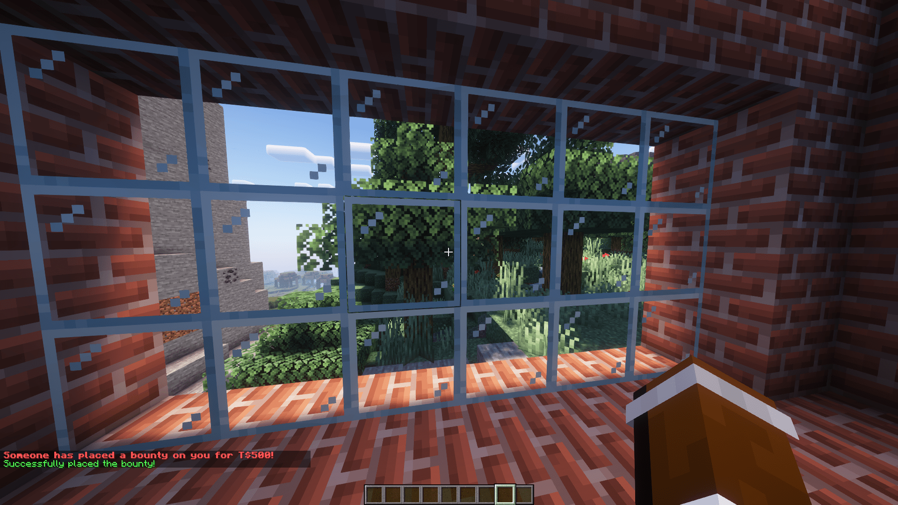
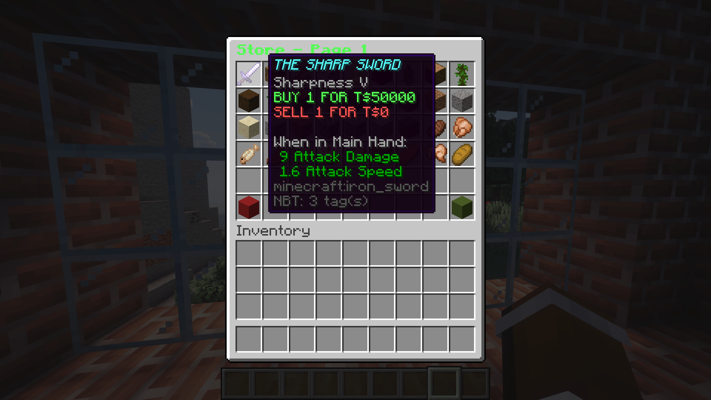
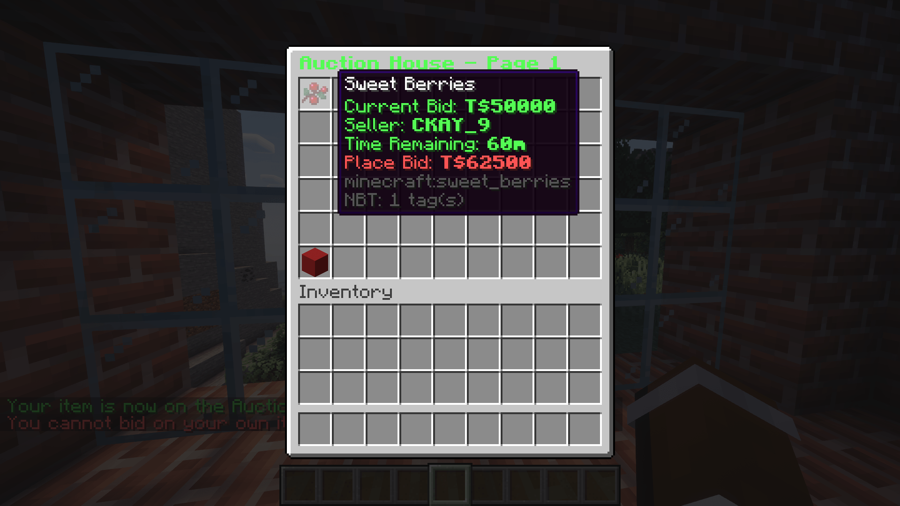

<div align="center">
    
</div>

*Plugin Version: 1.0.2*</br>
*Minecraft Version: 1.19+*

CxTokens is a token (money) system for Spigot/Paper Minecraft servers. 

## How to Install
1. Download the latest release of CxTokens
2. Move the .jar file into your servers /plugins folder
3. Reload/restart your server
4. Edit the config and store files in /plugins/CxTokens
5. Reload/restart your server to update config

## Features
- Lottery event
- Auction House
- Bounties
- Item Store
- Commands
- Local data storing (no need for a database)
- HTTP updates
- Highly configurable

### Commands
- cxtokens/tabout: Information about CxTokens
- tadmin: Admin commands/tools for CxTokens (e.g. add/subtract tokens)
- tbounty: Place a bounty on a player
- tbal: Get the balance of yourself or someone else
- tstore: Open the static token store
- tauction: Open the live auction house
- ttop: See who has the most tokens
- tsend: Send tokens to a player
- treset: Reset your token profile
- tlottery: Join the token lottery if its happening

### HTTP Updates
**Note: by default this is off.** 

This allows you to POST request the player data in data.yml to your webserver. The player data is sent as a JSON Array with the key "player_data": 
```
[
    {
        uuid: string,
        name: string,
        tokens: long (number),
        bounty: long (number)
    }, 
    ...
]
```

Additionally, the authorization header is sent with whatever is provided in the config file. This is to make sure you are processing valid requests from verified sources:
```
Headers {
    Authorization: YOUR_AUTH_KEY
}
```

<a href="https://github.com/CKAY-9/cxtokens-web">Example website using CxTokens HTTP data</a>

<div align="center">
    
    
    
    
</div>
