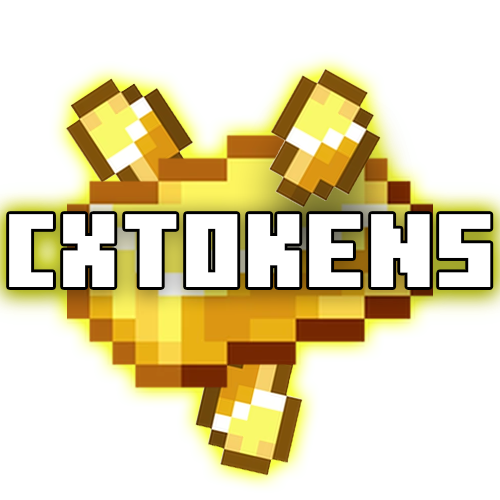
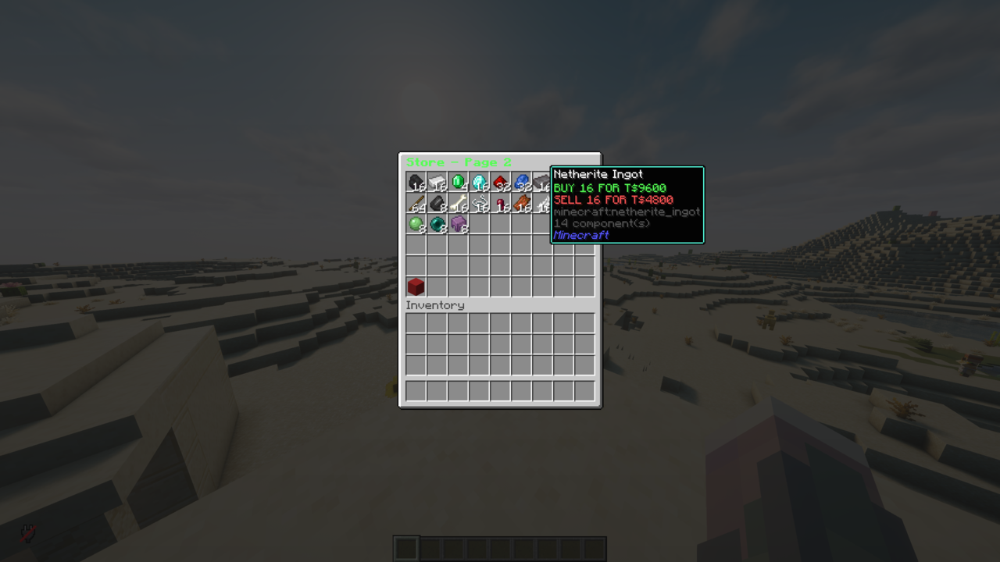
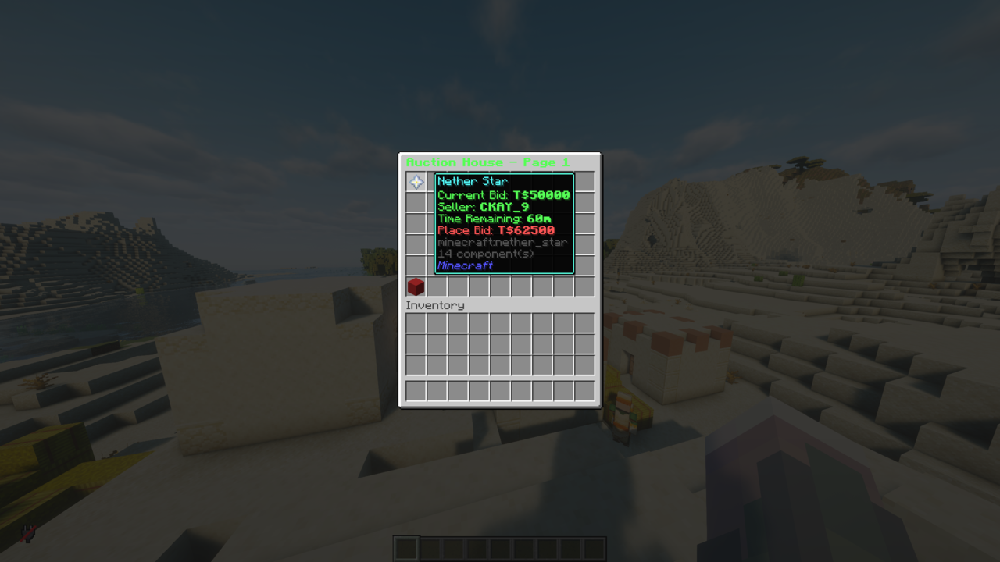
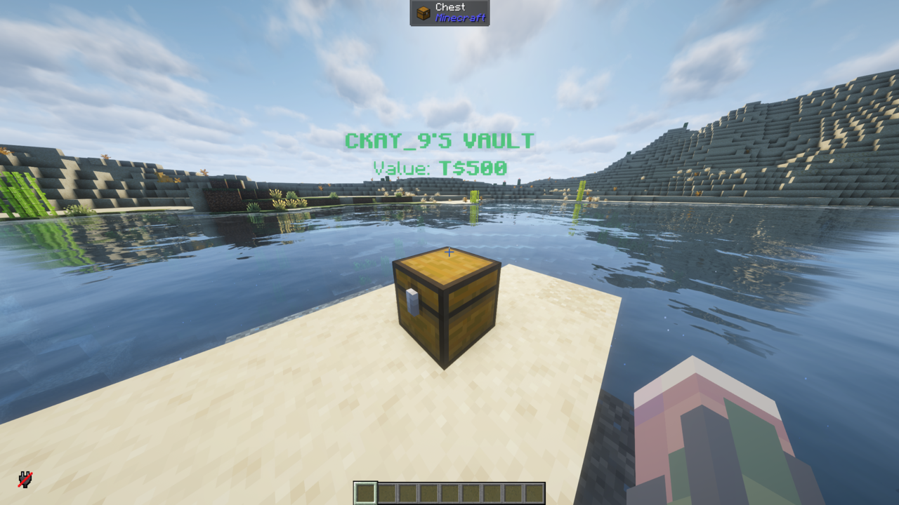
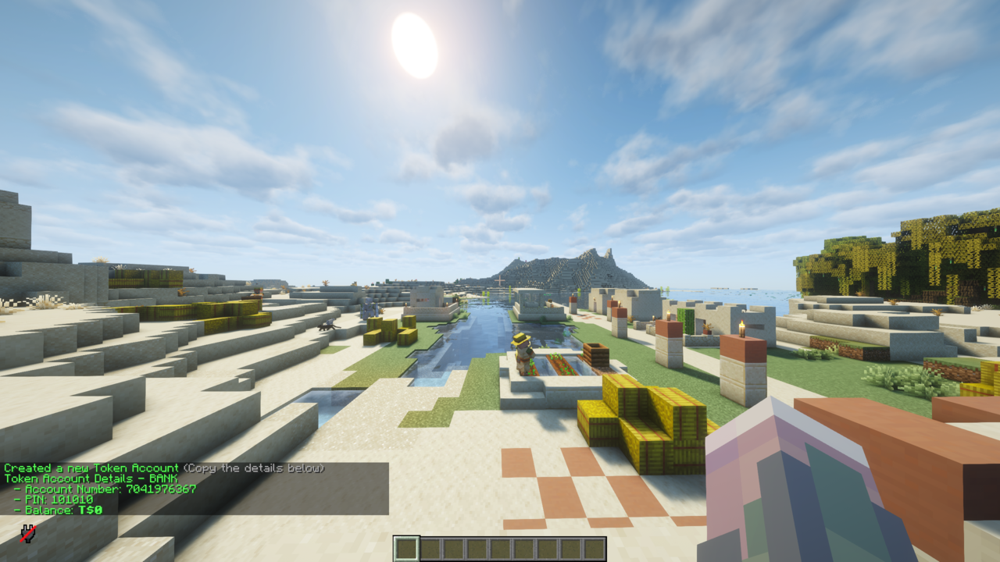

    

CxTokens is a token (money) system for Spigot/Paper Minecraft servers. 

## How to Install
1. Download the latest release of CxTokens
2. Move the .jar file into your servers /plugins folder
3. Reload/restart your server
4. Edit the config and store files in /plugins/CxTokens
5. Reload/restart your server to update config

## Features
CxTokens is packed full of features to guarenteee a well-rounded, and enjoyable playing experience.

### Lottery event
After a configurable amount of time, a new lottery will start where players are able to join for a set fee. Once the join period has ended, a lottery winner is randomly selected, giving the entire prize pool to the winning player

### Item Store
The Item Store (sometimes referred to as the static store) is a configurable, fixed store where
players are able to buy and sell items in an easy-to-use menu.

### Auction House
The Auction House allows players to sell their own unique items outside of the Item Store. Each bid is a set percentage more than the previous. Once the bid time has elapsed, the top bidder (if there is one) will recieve the item; otherwise, the seller will get the item back.

### Bounties
Bounties work just like they do in real life: someone can place a bounty on another person. If that bounty if fulfileed, e.g. the target dies, the killer is rewarded with the money.

### Vaults
Vaults allow players to store money in a physical location. These pair well if pay-on-death is enabled (players lose a certain amount of money to their killer on death)

### Token Accounts
Token Accounts give players the ability to access a common token balance. Anyone can access a token account gives the correct account number and PIN.

### Highly configurable
Almost every component of CxTokens is configurable. Disable, change, tweak, whatever you want in the config files. I do recommend changing the default static store values as they aren't fine-tuned. 

### Commands
- cxtokens/tabout: Information about CxTokens
- tadmin: Admin commands/tools for CxTokens (e.g. add/subtract tokens)
- tbounty: Place a bounty on a player
- tbal: Get the balance of yourself or someone else
- tstore: Open the static token store
- tauction: Open the live auction house
- ttop: See who has the most tokens
- tsend: Send tokens to a player
- tsell: Sell a container's (e.g. chests) contents all at once
- treset: Reset your token profile
- tlottery: Join the token lottery if its happening
- tvault: Create vaults
- taccount: Create, access, and manage Token Accounts
